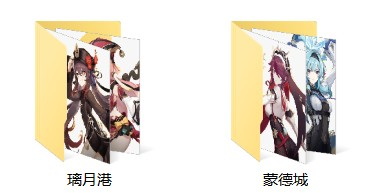

# Genshin Impact Characters

下载[原神官网](https://ys.mihoyo.com/main/character/mondstadt?char=0)的角色立绘



## 安装教程

需要安装 Chrome 浏览器才能使用。

Python >= 3.7

```shell
pip install -r requirements.txt
```

## 使用说明

```shell
python main.py
```

下载的图片会存放在 `output` 文件夹下。